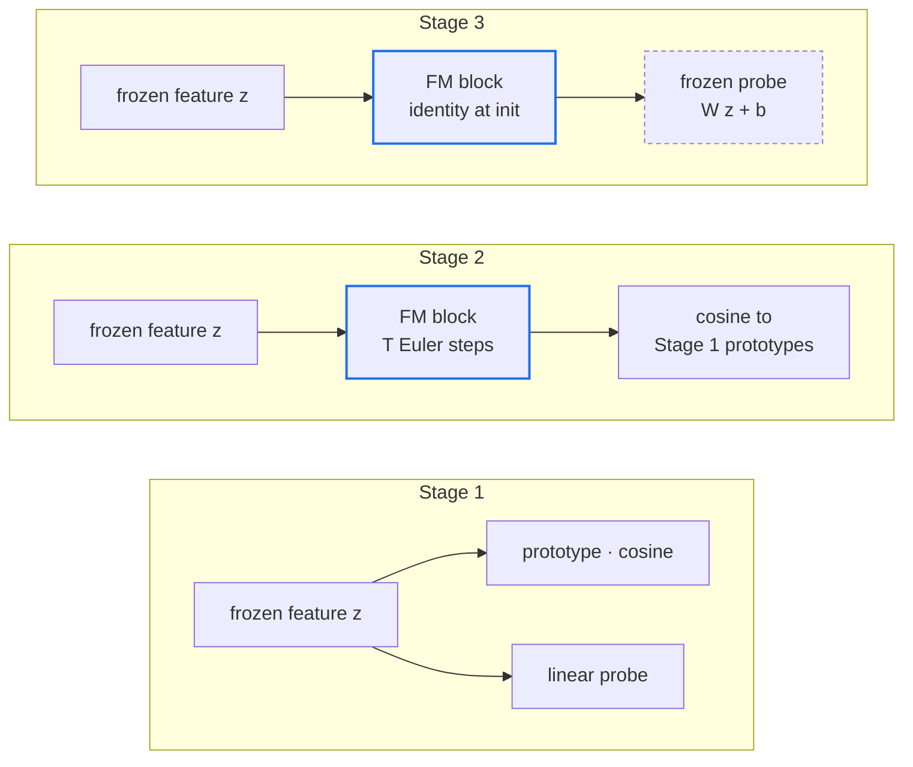
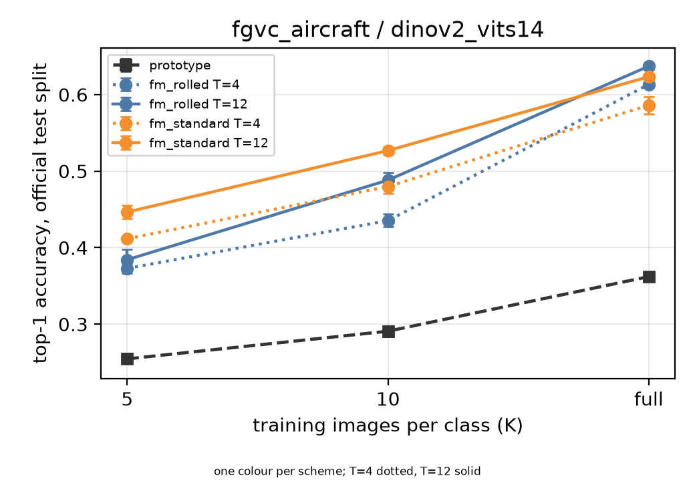
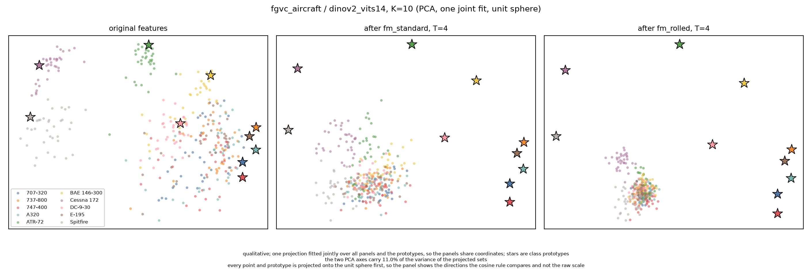
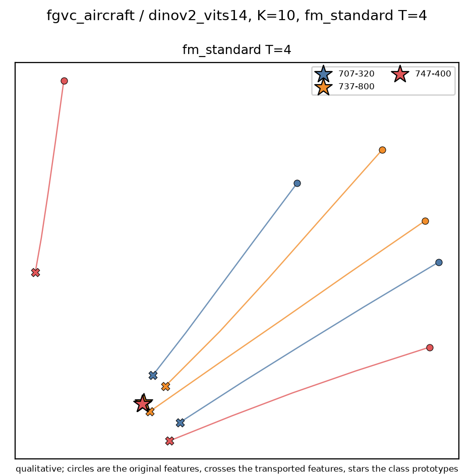
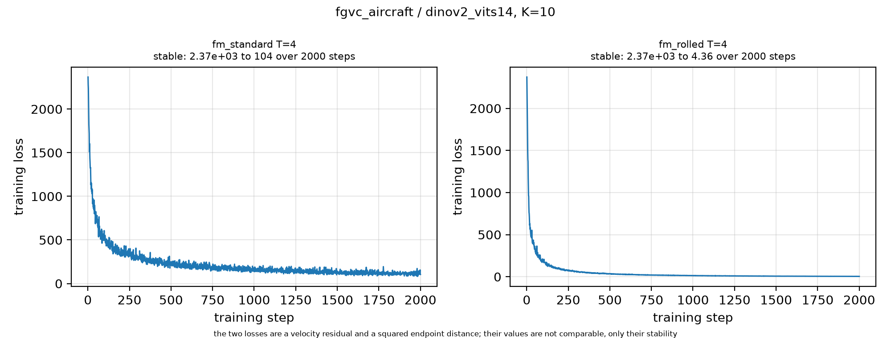
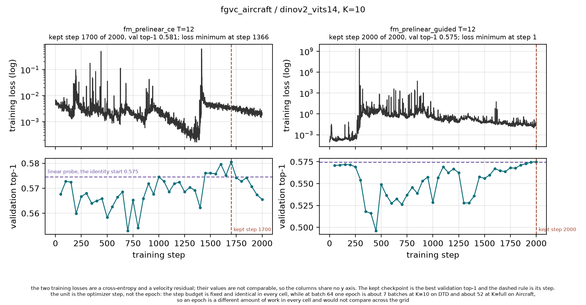
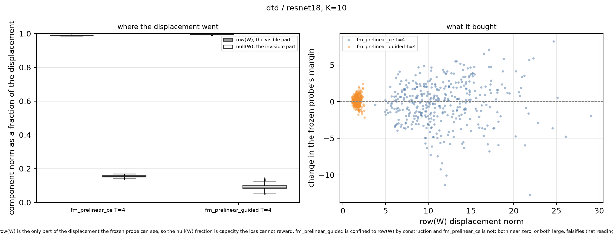
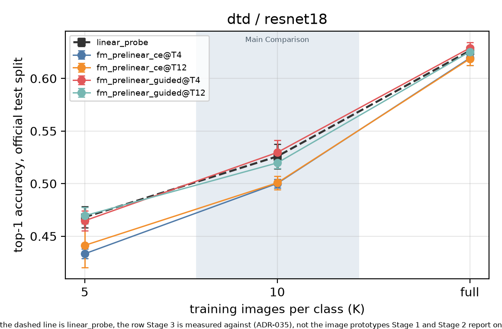
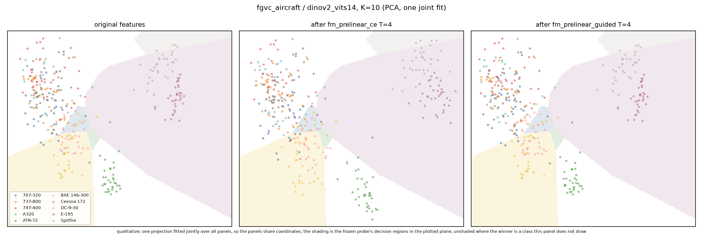

<div align="center">

# Flow Matching as a Layer

**Can a learned velocity field, placed inside a discriminative network, do work a classifier cannot do alone?**

Few-shot image classification on frozen foundation-model features.<br>
DTD and FGVC-Aircraft · ResNet-18 and DINOv2 ViT-S/14 · three stages, 264 graded runs.

<p>


</p>

<p>
<a href="#the-three-stages-at-a-glance">Overview</a> ·
<a href="#stage-1--baselines">Stage 1</a> ·
<a href="#stage-2--flow-matching-as-the-last-layer">Stage 2</a> ·
<a href="#stage-3--flow-matching-before-a-frozen-classifier">Stage 3</a> ·
<a href="#reproducing-the-study">Reproduce</a> ·
<a href="REPORT.md">Report</a>
</p>


<sub><b>The mechanism in miniature.</b> Three classes stretched along a shared direction. A nearest-prototype rule scores
0.875; after 8 Euler steps of an unconditional velocity field it scores 1.000. The field never sees a label: it infers
the basin from position alone.</sub>

</div>

---

## The idea

Flow matching (FM) is known as a generative technique: a velocity field `v_θ(z, t)` is trained without simulation to
transport one distribution onto another, and sampling integrates the ODE `dz/dt = v_θ(z, t)`. This project asks whether
the same block can serve as a **layer** inside a classifier, moving a feature somewhere a decision rule reads it better.

Everything runs on **frozen encoders and cached features**, so each experiment is a head fitted on vectors, not a
network trained on images. One evaluation loop runs every method on byte-identical, seed-fixed training subsets, which
makes "only the head changed" a property of the code rather than a promise.

## The three stages at a glance

<table>
<tr>
<th width="33%">Stage 1 · Baselines</th>
<th width="33%">Stage 2 · FM as the last layer</th>
<th width="33%">Stage 3 · FM before a frozen classifier</th>
</tr>
<tr>
<td valign="top">

**Question.** How far do standard heads get on frozen features, and where do they fall short?

**Built.** Linear probe and image-derived class prototypes with a cosine rule.

**Answer.** On Aircraft with DINOv2 the probe reaches **0.741** and the prototype rule stalls at **0.362**, on the same
features.

</td>
<td valign="top">

**Question.** Can transporting a feature toward its class prototype rescue the prototype rule?

**Built.** A velocity field ahead of the cosine rule, trained two ways: standard FM and rolled-out.

**Answer.** Yes on Aircraft, **+0.275** and 73% of the gap to the probe. No on DTD, where it loses in every row.

</td>
<td valign="top">

**Question.** Can transport improve features a trained linear classifier was already fitted to?

**Built.** An identity-initialized FM block ahead of the frozen probe, two new training strategies.

**Answer.** As specified, **no**. One constrained variant reaches **0.613** against the probe's 0.568 on one cell.

</td>
</tr>
</table>



> [!NOTE]
> **Protocol, shared by every stage.** DTD (partition 1, 47 classes) and FGVC-Aircraft (variant level, 100 classes), all
> classes, official train/val/test splits, never merged. ResNet-18 on both datasets, DINOv2 ViT-S/14 on Aircraft.
> K ∈ {5, 10, full} training images per class, three seeds per cell. Top-1 on the **complete** test split, reported as
> mean and sample std. Checkpoints are selected on validation accuracy, and the test split is opened only after `fit`
> returns.

---

## Stage 1 · Baselines

Two heads on frozen features. The **prototype** head normalizes each feature, averages per class, renormalizes, and
predicts `argmax_c cos(z, p_c)`. The **linear probe** is AdamW on a single linear layer with the checkpoint chosen on
validation accuracy.

<table>
<tr>
<td width="50%" valign="top">

**DTD · 47 classes · ResNet-18**

| K | Prototype | Linear probe |
|:--|--:|--:|
| 5 | **0.483** ±0.013 | 0.468 ±0.010 |
| 10 | 0.517 ±0.002 | **0.526** ±0.012 |
| full | 0.588 | **0.626** ±0.004 |

</td>
<td width="50%" valign="top">

**FGVC-Aircraft · 100 classes**

| Encoder | K | Prototype | Linear probe |
|:--|:--|--:|--:|
| ResNet-18 | 5 | 0.167 | **0.207** |
| | 10 | 0.191 | **0.266** |
| | full | 0.252 | **0.368** |
| DINOv2 | 5 | 0.255 | **0.430** |
| | 10 | 0.291 | **0.568** |
| | full | 0.362 | **0.741** |

</td>
</tr>
</table>

<sub>Full-data prototype has no randomness and is a single run. Std for every Aircraft cell is at most 0.009.</sub>

### What Stage 1 found

| | |
|:--|:--|
| **The heads cross over on DTD.** | At K=5 the training-free prototype wins; by K=10 the probe overtakes it. On Aircraft the probe leads at every K, because 100 fine-grained class means sit too close together for a centroid rule. |
| **Better features do not help a centroid.** | Switching ResNet-18 to DINOv2 on Aircraft lifts the probe by 0.373 and the prototype by only 0.110. The gap at full data grows to **0.379**. |
| **The gap has one cause.** | Whitening by the shared within-class covariance, then applying the identical centroid rule, reaches **0.768**. DINOv2 places classes well, but they are stretched, not round, and cosine-to-centroid discards exactly that structure. |
| **Nothing is saturated.** | No cell plateaus between K=10 and full, so the size curves are real curves. |

That diagnosis sets up Stage 2: the prototypes become the transport target, so the FM block is in effect asked to learn
the whitening, with a floor at 0.362, a probe reference at 0.741, and a whitened ceiling at 0.768.

<table>
<tr>
<td width="50%"></td>
<td width="50%"></td>
</tr>
<tr>
<td><sub><b>Accuracy against K.</b> The probe-prototype gap widens with data instead of closing.</sub></td>
<td><sub><b>Joint PCA of features and prototypes.</b> One projection fitted to both, so prototypes live in the space they helped define.</sub></td>
</tr>
</table>

<details>
<summary><b>More Stage 1 figures:</b> confusion matrix and probe training curves</summary>
<br>
<table>
<tr>
<td width="50%"></td>
<td width="50%"></td>
</tr>
<tr>
<td><sub>Row-normalized confusion. The errors are semantic: <code>C-47 → DC-3</code>, the same airframe under two names. Every matrix ships a <code>top_confusions.csv</code>.</sub></td>
<td><sub>Probe loss and validation curves, selected epoch marked.</sub></td>
</tr>
</table>
</details>

---

## Stage 2 · Flow matching as the last layer

Keep the Stage 1 decision rule and **move the feature first**. The FM head integrates a learned field for `T` Euler
steps and hands the result to the unchanged prototype head:

```
z_{k+1} = z_k + (1/T) · v_θ(z_k, k/T),     k = 0 … T-1,   z_0 = z
ŷ       = argmax_c  cos(z_T, p_c)
```

The field is a two-layer MLP (width 512, SiLU) that takes the feature with the scalar time concatenated. The FM head
does not reimplement the cosine rule: it calls the Stage 1 head's own `predict`, so a zero field reproduces the baseline
bit-identically.

### Two training schemes, one moving part

Both schemes pair each training feature `z_i` with its own class prototype `p_{y_i}`, share one training loop, and
classify identically. Only the loss differs.

| | Standard FM | Rolled-out FM |
|:--|:--|:--|
| **Loss** | `‖ v_θ(z_t, t) − (p_y − z) ‖²` on the straight path `z_t = (1−t) z + t p_y` | `‖ ẑ_T − p_y ‖²` after running the full `T`-step rollout |
| **Solves the ODE while training** | No, simulation-free | Yes, backpropagates through all `T` steps |
| **What `T=4` vs `T=12` means** | One field read at two resolutions: the gap measures **curvature** | Two different networks: the gap measures **capacity** |
| **Mean fit time** | 5.9 s at T=4 | 13.8 s at T=4 · 37.8 s at T=12 |

### Results

Top-1 at **T=12**, change against the prototype baseline the block replaces.

| Cell | K | Prototype | Standard FM | Rolled-out FM | Probe (reference) |
|:--|:--|--:|--:|--:|--:|
| **Aircraft · DINOv2** | 5 | 0.255 | **0.447** <sub>+0.192</sub> | 0.384 <sub>+0.130</sub> | 0.430 |
| | 10 | 0.291 | **0.527** <sub>+0.236</sub> | 0.488 <sub>+0.197</sub> | 0.568 |
| | full | 0.362 | 0.623 <sub>+0.261</sub> | **0.637** <sub>+0.275</sub> | 0.741 |
| **Aircraft · ResNet-18** | 5 | 0.167 | **0.188** <sub>+0.021</sub> | 0.179 <sub>+0.012</sub> | 0.207 |
| | 10 | 0.191 | **0.232** <sub>+0.041</sub> | 0.219 <sub>+0.028</sub> | 0.266 |
| | full | 0.252 | **0.307** <sub>+0.055</sub> | 0.272 <sub>+0.020</sub> | 0.368 |
| **DTD · ResNet-18** | 5 | **0.483** | 0.454 <sub>−0.029</sub> | 0.409 <sub>−0.074</sub> | 0.468 |
| | 10 | **0.517** | 0.508 <sub>−0.009</sub> | 0.465 <sub>−0.052</sub> | 0.526 |
| | full | **0.588** | 0.574 <sub>−0.014</sub> | 0.556 <sub>−0.032</sub> | 0.626 |

<sub>T=4 rows are in the full results table. For both schemes they are never above the T=12 row of the same cell.</sub>

> [!IMPORTANT]
> **The layer helps on Aircraft and hurts on DTD, with no overlap.** It beats the prototype in all 24 Aircraft rows and
> loses in all 12 DTD rows. It recovers 73% of the prototype-to-probe gap on the cell where that gap is widest, and it
> reaches the probe on no cell.

<table>
<tr>
<td width="42%" valign="top"></td>
<td width="58%" valign="top"></td>
</tr>
<tr>
<td><sub><b>Accuracy against K.</b> One colour per scheme; T=4 dotted, T=12 solid.</sub></td>
<td><sub><b>Before and after transport, on the unit sphere.</b> The cloud spreads apart and stays far from the stars.</sub></td>
</tr>
</table>

### What Stage 2 found

- **Standard training beats rolled-out in 16 of 18 matched comparisons.** Both exceptions are Aircraft · DINOv2 at
  K=full. Rolled-out training costs memory linear in `T` and, on this protocol, usually buys nothing.
- **The block learns a direction, not a destination.** Transported points typically finish far from their prototype:
  on Aircraft · DINOv2 the mean cosine to the correct prototype is 0.115. Pairwise cosine among transported test points
  falls from 0.443 to near zero, so the block spreads the cloud rather than collapsing it onto class targets. Read
  literally, "transport to class prototypes" is not what the trained system does, even where it works.
- **`T=12` beats `T=4` for both schemes**, and the two gaps measure different things: curvature for standard FM,
  capacity for rolled-out.

<details>
<summary><b>More Stage 2 figures:</b> flow trajectories and training curves</summary>
<br>
<table>
<tr>
<td width="40%"></td>
<td width="60%"></td>
</tr>
<tr>
<td><sub>Flow trajectories: circles are original features, crosses transported features, stars prototypes.</sub></td>
<td><sub>Training loss and validation accuracy per scheme, kept step marked.</sub></td>
</tr>
</table>
</details>

---

## Stage 3 · Flow matching before a frozen classifier

Stage 2 placed the block ahead of a rule with no parameters. Stage 3 places it ahead of one that has already spent them:
the Stage 1 linear probe, trained on the same subset and then **frozen**.

```
z  ──FM──▶  ẑ  ──frozen W, b──▶  logits
```

**Initialization is exact, not approximate.** Zeroing the field's output layer makes `v_θ ≡ 0`, so the untrained system
reproduces the probe's logits bit-identically. Every reported change therefore measures training, not a starting gap.

### Two new strategies

These are **not** Stage 2's two schemes.

| | Strategy 1 · Rolled-out cross-entropy | Strategy 2 · Classifier-guided targets |
|:--|:--|:--|
| **Idea** | Run the full rollout, classify `ẑ` with the frozen probe, backpropagate through every step | Build an improved target `ẑ'` by a gradient step on the classification loss, then take an ordinary FM step toward it |
| **Loss** | `CE(W ẑ + b, y)` | `‖ v_θ(z_t, t) − (ẑ' − z) ‖²`, target recomputed as training proceeds |
| **Failure mode** | **Memorizes**: training CE falls to 1e-6 while the probe's test margin worsens | **Diverges**: peak training loss 1e13 to 1e20, the target chasing the field that defines it |

`T` was chosen once by a rule fixed before the grid finished (mean validation top-1 over the designated cells) and landed
on **T=12**, by a margin of 0.0026.

### The Main Comparison

K=10, T=12, the two cells the specification designates. Change is against the frozen probe.

| Cell | Linear probe | Strategy 1 | Strategy 2 |
|:--|--:|--:|--:|
| **DTD · ResNet-18** | **0.526** ±0.012 | 0.501 ±0.006 <sub>−0.025</sub> | 0.520 ±0.005 <sub>−0.006</sub> |
| **Aircraft · DINOv2** | 0.568 ±0.005 | **0.570** ±0.003 <sub>+0.002</sub> | 0.567 ±0.005 <sub>−0.002</sub> |

> [!IMPORTANT]
> **As specified, neither strategy beats the probe.** Across all nine cells at T=12, no configuration gains past its own
> seed spread, and every movement past that spread is a loss. The prediction recorded before the runs, a gain at low K,
> failed. We report it as a failed prediction, not a result reinterpreted afterwards.



<sub><b>Training behaviour, Aircraft · DINOv2 · K=10.</b> Top row training loss, bottom row validation top-1. The dashed
rule is the probe, where every curve starts. Strategy 2's loss bottoms at step 1 and passes 1e9 by step 250;
checkpoint selection, not convergence, decides both rows.</sub>

### Beyond the specification

These runs live apart from the graded grid and never reach the results table.

**Constraining Strategy 2's target is the one change that gains.** Capping the update at `‖ẑ' − z‖ ≤ ρ‖z‖`, with `ρ`
selected on validation:

| Configuration | Mean val | Test, DTD | Test, Aircraft · DINOv2 |
|:--|--:|--:|--:|
| **cap ρ = 0.15** (selected) | **0.5688** | 0.535 | **0.613** |
| cap ρ = 0.25 | 0.5661 | 0.534 | 0.609 |
| cap ρ = 0.1 | 0.5635 | 0.534 | 0.600 |
| cap ρ = 0.5 | 0.5493 | 0.523 | 0.595 |
| uncapped, as specified | 0.5439 | 0.520 | 0.567 |

On Aircraft that is **+0.044** over the probe, about eight times the probe's spread, with an interior optimum and a
validation ranking that matches the test ranking at every cap. On DTD the +0.009 sits inside the probe's spread, and we
do not claim it.

<table>
<tr>
<td width="62%" valign="top"></td>
<td width="38%" valign="top">

**Where the displacement went.** A frozen linear classifier only sees the part of `ẑ − z` inside `row(W)`. We expected
Strategy 2 to stay there by construction. It does not: its fitted field puts 0.49 to 0.75 of its displacement in
`null(W)` on DTD. Strategy 1 puts 0.88 to 0.99 exactly where the classifier can see it, and still gains nothing. The
negative result is not capacity wasted out of sight.

</td>
</tr>
</table>

| Other variants | Outcome |
|:--|:--|
| **Displacement penalty on Strategy 1** (`λ_disp = 0.01`) | DTD 0.501 → **0.528**. Stops the loss, does not beat the probe: what a memorization fix should look like. |
| **Remaining Strategy 2 knobs** (step size, target steps) | Ten configurations span 0.005 on validation; every one diverges. |
| **Jointly fine-tuning the classifier** (optional extension, 108 runs) | Best joint 0.523 / 0.578 / 0.273 on the three K=10 cells. The penalty does the work, not the unfreezing, and the stage loses its shared frozen classifier. |
| **Hybrid of the two strategies · starting from a Stage 2 field** | The hybrid matches its better half and never exceeds it. The Stage 2 start recovers most of DTD's loss but trails the capped Strategy 2. |

<details>
<summary><b>More Stage 3 figures:</b> accuracy against K and feature panels</summary>
<br>
<table>
<tr>
<td width="40%"></td>
<td width="60%"></td>
</tr>
<tr>
<td><sub>Both strategies against the probe across K.</sub></td>
<td><sub>Original and transported features in one joint projection. The pictures are undramatic, which is itself the finding.</sub></td>
</tr>
</table>
</details>

---

## What we cannot claim

<details>
<summary>The caveats that qualify the numbers above</summary>

- **The DTD Stage 2 rows are partly an artifact** of checkpoint selection: those cells keep a step near the floor of
  the selection grid.
- **One gain is not a method.** The capped Strategy 2 result is two cells at one K, with `ρ` selected over five values
  on the same cells it is reported on. It needs the full grid before it could be called the Stage 3 method.
- **Neither graded Stage 3 row is a converged fit.** Strategy 1 is kept at step 83 to 100 of 2000 on the low-K DTD
  cells, and Strategy 2 diverges by construction.
- **`T` was chosen on a 0.0026 margin**, smaller than every cell's seed spread. T=12 says which way the coin landed.
- **Row-space and margin diagnostics are single-seed**, while the accuracy beside them is a three-seed mean.
- **Reverse flow is built and tested but never run**, so nothing here rests on it.
- **No comparison to published results.** The protocol is the project's own, and comparisons stay inside it.

</details>

---

## Reproducing the study

Requires [uv](https://docs.astral.sh/uv/). One lockfile serves Linux with CUDA and CPU-only machines.

```bash
uv sync
./scripts/check                  # ruff + pytest + coverage; the exit code is the verdict
```

<details open>
<summary><b>Full pipeline</b></summary>

```bash
# 1. Cache features once per (dataset, split, encoder). Datasets download on first use.
uv run python -m fm_fewshot features --dataset dtd --split train --encoder resnet18

# 2. The graded grids. Add --dry-run to list the runs first.
uv run python -m fm_fewshot sweep --config config/stage1.yaml            # 48 runs
uv run python -m fm_fewshot sweep --config config/stage2_standard.yaml   # 54 runs
uv run python -m fm_fewshot sweep --config config/stage2_rolled.yaml     # 54 runs
uv run python -m fm_fewshot sweep --config config/stage3_ce.yaml         # 54 runs
uv run python -m fm_fewshot sweep --config config/stage3_guided.yaml     # 54 runs

# 3. The table and every figure, from stored results
uv run python -m fm_fewshot report
uv run python -m fm_fewshot figures --config config/figures.yaml --stage 1   # also --stage 2, --stage 3
uv run python scripts/toy_transport_figure.py

# 4. Fairness guard: every head at each setting trained on identical rows
./scripts/check_subsets
```

</details>

<details>
<summary><b>Diagnostics</b> (write next to a run, never into the table)</summary>

```bash
uv run python -m fm_fewshot run      --config results/<run_id>/config.yaml   # one cell
uv run python -m fm_fewshot reverse  --config results/<run_id>/config.yaml   # integrate a Stage 2 field backwards
uv run python -m fm_fewshot diagnose --config results/<run_id>/config.yaml   # feature-scale diagnostics
uv run python -m fm_fewshot rowspace --config results/<run_id>/config.yaml   # Stage 3 row(W) / null(W) split
```

</details>

A classifier run on cached features finishes in under a minute, and every figure redraws from stored results without
a GPU. The 264 graded runs and the generated results table are published in the
[public repository](https://github.com/eyalsht/cvlab-fm-fewshot-public/blob/main/results/TABLE.md).

---

## Under the hood

<details>
<summary><b>Repository map</b></summary>

```
src/fm_fewshot/
├── sdk/                 public entry points: build_features · run_experiment · run_sweep · figures · diagnostics
├── shared/              frozen dataclass contracts · strict yaml config · device gatekeeper
└── services/
    ├── data/            DTD and Aircraft loaders · balanced K-per-class subset sampler
    ├── features/        frozen encoders · npz feature cache with sha256
    ├── heads/           FewShotHead interface · prototype · linear probe
    │                    Stage 2: fm_standard · fm_rolled   Stage 3: fm_prelinear_ce · fm_prelinear_guided
    ├── flow/            velocity MLP · linear path · CFM objective · Euler/midpoint solver · reverse · 2D toy
    │   └── training/    shared loop · standard · rolled_out · rolled_out_ce · classifier_guided
    └── evaluation/      run loop · sweep · report · figure families · diagnostics · subset guard
config/                  one grid per stage and scheme · Stage 3 ablation and joint grids · figure settings
scripts/                 check · check_subsets · toy transport figure
tests/                   unit and integration suites
```

</details>

| Principle | How the code enforces it |
|:--|:--|
| **Only the head changes** | One `FewShotHead` interface, `fit(train_x, train_y, val_x, val_y)` and `predict(x)`. One loop runs every method; `check_subsets` verifies identical rows across all 264 runs. |
| **Test is for evaluation only** | The loop opens the test cache after `fit` returns. A head has no route to test rows. |
| **Independent low-shot draws** | Subsets are seeded with `SeedSequence([seed, k])`, so 5-shot and 10-shot are independent, not nested. Subset and initialization seeds are separate streams. |
| **Every number traceable** | Each run stores its full config, git commit, and explicit subset indices. `report` refuses a cell with fewer runs than the protocol requires. |
| **Bit-identical reruns** | Same seed and device give identical summaries. TF32 is disabled at extraction, which dropped a 3.1e-3 feature error floor to 6.2e-6. |
| **Interrupted runs leave nothing** | Results are written to a temporary directory and renamed atomically. |
| **Invariants, not accuracy, in tests** | 814 tests at 96.7% coverage: exact identity at init, solver convergence orders against closed forms, determinism, gradient reach through the rollout. |

---

<div align="center">
<sub>CVLAB Summer Project 2026, University of Haifa. The written report is <a href="REPORT.md">REPORT.md</a>.<br>
Planning documents live in a separate private repository; <code>ADR-0xx</code> and <code>PRD_*</code> references in the source point there.</sub>
</div>
