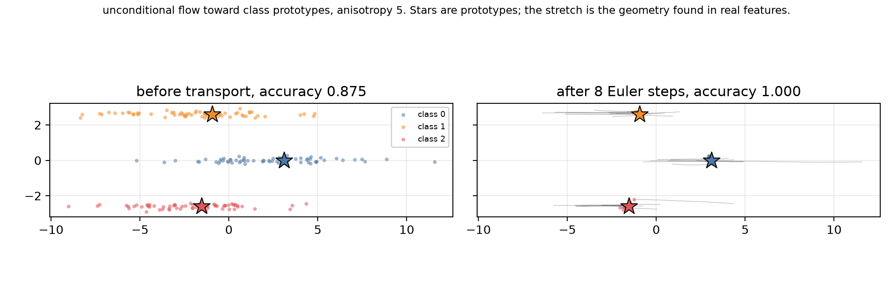
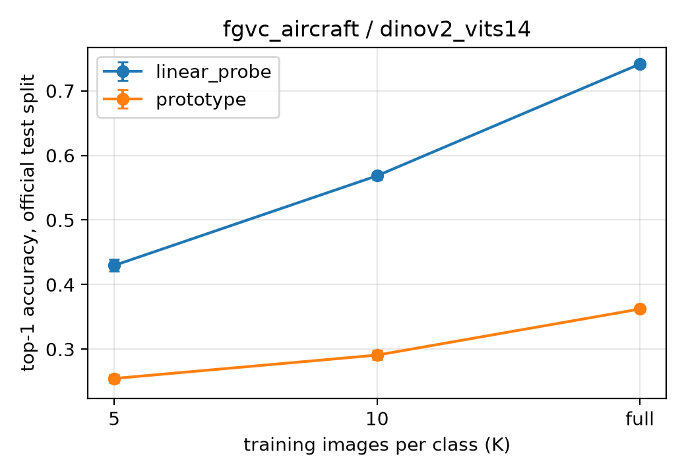
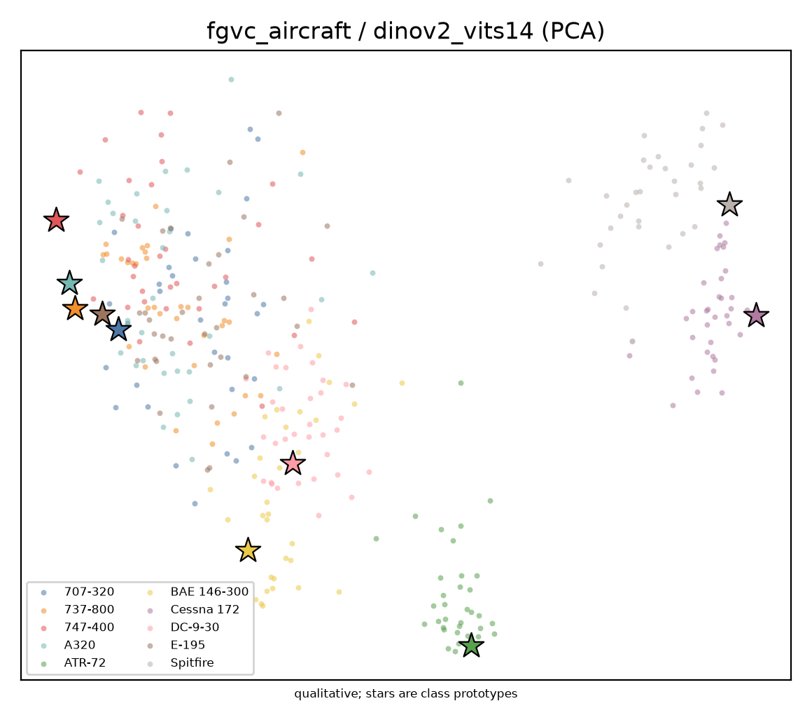
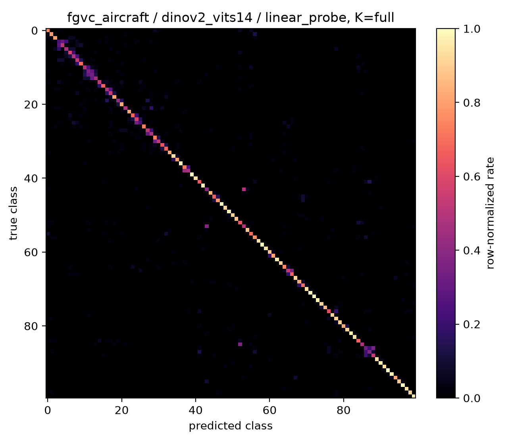
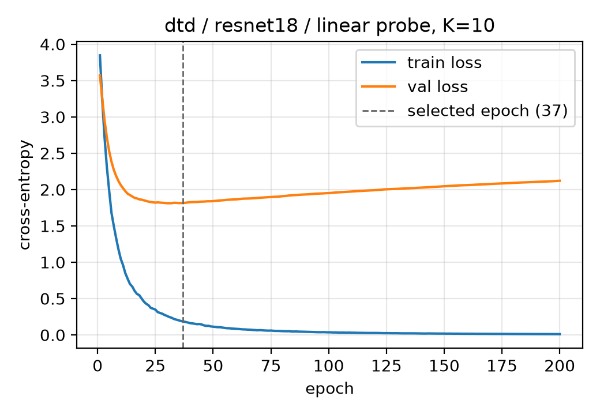
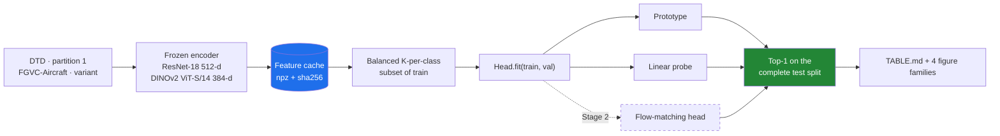

<div align="center">

# 🌊 Flow Matching as a Layer

**Can a learned velocity field, dropped inside a discriminative network, fix what a centroid classifier cannot?**

Few-shot image classification over frozen foundation-model features — DTD & FGVC-Aircraft, ResNet-18 & DINOv2.

<p>


</p>



<sub><b>The whole thesis in one picture.</b> Stretched classes, a centroid rule at 0.875 — and after 8 Euler steps of an
unconditional velocity field, 1.000. The field never sees a label; it infers the basin from position alone.</sub>

</div>

---

## The idea in sixty seconds

Freeze a pretrained encoder. Take *K* images per class. Average them into a prototype, classify by cosine similarity.
It is the standard few-shot recipe, and on good features it leaves a **lot** on the table.

Our Stage 1 numbers say exactly how much: on FGVC-Aircraft with DINOv2 features, a linear probe reaches **74.1%** while
the prototype rule stalls at **36.2%** — on the *same* features, the *same* data. The information is in there. The
centroid just cannot reach it.

> [!IMPORTANT]
> **Why.** DINOv2 classes are linearly separable but not *compact* around their means — they are stretched along a
> shared direction. A cosine-to-centroid rule reads that stretch as distance and loses accuracy a linear map recovers.
>
> **The bet.** Learn a velocity field that *transports* a feature toward its class basin before classifying it. That is
> flow matching, used not as a generator but as a **layer**.

---

## 📊 Stage 1 results

Top-1 accuracy on the **complete official test split**. Mean ± sample std over three seeds
(subset seed at K=5/10, initialization seed at full). Full-data prototype has no stochasticity, so it is one run.

### DTD · 47 classes · ResNet-18

| Head | K=5 | K=10 | Full train split |
|:--|--:|--:|--:|
| Prototype | **48.3** ±1.3 | 51.7 ±0.2 | 58.8 |
| Linear probe | 46.8 ±1.0 | **52.6** ±1.2 | **62.6** ±0.4 |

### FGVC-Aircraft · 100 classes

| Encoder | Head | K=5 | K=10 | Full train split |
|:--|:--|--:|--:|--:|
| ResNet-18 | Prototype | 16.7 ±0.5 | 19.1 ±0.6 | 25.2 |
| ResNet-18 | Linear probe | 20.7 ±0.3 | 26.6 ±0.7 | 36.8 ±0.2 |
| **DINOv2 ViT-S/14** | Prototype | 25.5 ±0.6 | 29.1 ±0.7 | 36.2 |
| **DINOv2 ViT-S/14** | Linear probe | **43.0** ±0.9 | **56.8** ±0.5 | **74.1** ±0.1 |

### Three findings worth a meeting

<table>
<tr>
<td width="33%" valign="top">

### 🔀 The crossover
On DTD at K=5 the **prototype beats the probe** (48.3 vs 46.8) and loses by K=10. With 5 images per class a mean is a
better estimator than 47×512 fitted parameters. The curves cross exactly where the bias–variance story says they should.

</td>
<td width="33%" valign="top">

### 📉 The prototype gap
Swapping ResNet-18 → DINOv2 on Aircraft **doubles** the probe (36.8 → 74.1) but barely moves the prototype
(25.2 → 36.2). Better features do not help a centroid rule. **That 37.9-point gap is Stage 2's target.**

</td>
<td width="33%" valign="top">

### ✈️ Honest confusions
The errors are semantic, not noise. `C-47 → DC-3` at 48% — the same airframe under two names.
`BAE 146-300 → 146-200` at 44%. `dotted → polka-dotted` at 43%. The models are wrong the way a person would be wrong.

</td>
</tr>
</table>

---

## 🖼️ The figure families

All four regenerate from stored results and the feature caches — **byte-identically**, never from notebook state.

<table>
<tr>
<td width="50%"></td>
<td width="50%"></td>
</tr>
<tr>
<td><b>F1 · Accuracy vs training-set size.</b> The gap between the two heads widens with K instead of closing.</td>
<td><b>F4 · Joint PCA of features and prototypes.</b> The projection is fitted to both together — transforming
prototypes afterwards would place them in a space they did not help define.</td>
</tr>
<tr>
<td></td>
<td></td>
</tr>
<tr>
<td><b>F3 · Row-normalized confusion.</b> At 100 classes the axis labels are unreadable, so every matrix ships a
<code>top_confusions.csv</code> next to it.</td>
<td><b>F2 · Probe loss curves</b> with the selected epoch marked. Validation accuracy picks the checkpoint; ties keep
the earlier epoch.</td>
</tr>
</table>

---

## 🏗️ How it fits together



**The test split is unreachable by construction.** `run_experiment` opens the test cache *after* `fit` returns. A head
receives train and validation tensors as arguments and has no route to test rows — so "test is for final evaluation
only" is a property of the code, not a rule someone has to remember.

<details>
<summary><b>Repository map</b></summary>

```
src/fm_fewshot/
├── sdk/              the only public import surface: build_features · run_experiment · run_sweep · make_figures
├── shared/
│   ├── contracts.py  frozen dataclasses — a subset or a result is a fact, never mutated
│   ├── config.py     yaml round-trip; unknown keys are rejected by name
│   └── gatekeeper.py device resolution + heavy-job guard (fail fast on CPU, override flag available)
└── services/
    ├── data/         DTD & FGVC-Aircraft loaders · balanced K-per-class subset sampler
    ├── features/     frozen encoders · npz cache with sha256, TF32 disabled at extraction
    ├── heads/        FewShotHead ABC + registry · prototype · linear probe
    ├── flow/         linear path · CFM objective · Euler/midpoint solver · velocity MLP · 2D toy
    └── evaluation/   run loop · protocol-derived sweep · report · the four figure families
```

</details>

---

## ⚡ Quickstart

Requires [uv](https://docs.astral.sh/uv/). One lockfile serves both machines: Windows resolves the CPU torch wheel,
Linux resolves an explicit CUDA 12.8 build. No flags on either.

```bash
uv sync
./scripts/check                 # ruff + pytest + coverage — one command, exit code is the verdict
./scripts/check --all           # including slow tests that need real datasets and checkpoints
```

Run the study:

```bash
# 1. Cache features once per (dataset, split, encoder). Downloads on first use.
uv run python -m fm_fewshot features --dataset dtd --split train --encoder resnet18

# 2. Every cell of the Stage 1 grid, in one command
uv run python -m fm_fewshot sweep --config config/stage1.yaml --dry-run   # list the runs
uv run python -m fm_fewshot sweep --config config/stage1.yaml

# 3. Regenerate the table and the figures
uv run python -m fm_fewshot report
uv run python -m fm_fewshot figures --config config/figures.yaml
uv run python scripts/toy_transport_figure.py

# 4. Optional Stage 2 diagnostics: integrate one run's field backwards
uv run python -m fm_fewshot reverse --config results/<run_id>/config.yaml
```

> [!NOTE]
> `report` **refuses** to emit a cell holding fewer runs than the protocol requires. Averaging two runs where the
> protocol wants three would silently produce a number nobody could reproduce from the stated protocol.

> [!NOTE]
> `reverse` writes `results/<run_id>/reverse.json` and nothing else. Its numbers are diagnostics: they read the true
> test labels, so by rule they never inform a head configuration and never appear in `TABLE.md`.

---

## 🔬 What has actually been built

<details open>
<summary><b>Stage 1 — protocol, baselines, and the diagnosis</b> ✅</summary>

- **Data.** DTD at partition 1 and FGVC-Aircraft at the `variant` annotation level, both at official train/val/test.
  Those two arguments live in `DATASET_SPECS`, not at call sites, so no experiment can quietly ask for a different
  partition or a coarser label set. Aircraft's combined `trainval` split is unreachable by construction — the protocol
  forbids merging train and validation.
- **Subset sampler.** Exactly K rows per class, seeded `SeedSequence([seed, k])` so 5-shot and 10-shot draws at one
  seed are *independent* rather than nested. A nested design would correlate the two settings' errors and understate
  the spread.
- **Encoders.** ResNet-18 (512-d pre-classifier) and DINOv2 ViT-S/14 (384-d class token, via timm). Each carries its
  own preprocessing — DINOv2's 518×518 input is 14×37, and ViT-S/14 cannot accept a size that is not a multiple of 14.
- **Cache.** Raw float32 npz per split plus a meta json carrying a sha256, so `scp` between the laptop and the GPU box
  is safe. L2 normalization happens at *read* time, so one cache serves both settings.
- **Heads.** One `FewShotHead` interface for every method, so the evaluation loop never branches per method.
- **Evaluation.** Protocol-derived sweep, mean ± sample std aggregation, four figure families, and `TABLE.md`.

</details>

<details open>
<summary><b>Stage 2 — the flow machinery</b> 🚧</summary>

- **Path & objective.** Linear conditional OT path; `L_CFM = E ‖v_θ(x_t,t) − (x₁−x₀)‖²`. Simulation-free — no ODE is
  solved during training. Checked against a hand computation and asserted exactly zero when the field is exact.
- **Solver.** Fixed-step Euler and midpoint over [0,1], measured convergence orders **1.0** and **2.0** against a
  closed-form solution. Step count is never chosen internally — it is a first-class experiment axis. No `no_grad`
  anywhere, so the same code path serves inference and rolled-out training.
- **Velocity network.** Small MLP, two hidden layers of width 512, SiLU. Time enters as the **scalar `t` concatenated
  to the feature**, which is what the Stage 2 specification asks for. Our sinusoidal embedding is kept as a one-cell
  ablation, because one scalar among hundreds of feature dimensions is easy to ignore and a field that ignores `t`
  still trains and still transports — that failure would be silent. So the suite asserts it directly: a fitted scalar
  field must separate two distinct times on one input.
- **2D toy.** The Stage 2 mechanism in miniature, and the honest check before any of it touches real features.

> The toy's first version was three well-separated isotropic Gaussians. It passed the 95%-at-8-steps criterion
> immediately and was **worthless** — nearest prototype already scored 1.000 before transport, so "transport beats the
> baseline" could only be satisfied trivially. It was replaced with the geometry the Stage 1 diagnosis found in real
> features. The flow now recovers the *entire* anisotropy loss: **0.875 → 1.000** at stretch 5, **0.786 → 1.000** at
> stretch 7, and nothing at all on round classes, which is the control. The suite asserts the toy is still hard enough
> to discriminate, because a toy that stops discriminating is a test that stopped testing.

- **The head.** `fm_standard` transports a frozen feature toward its class prototype and then classifies with the
  Stage 1 cosine rule, unchanged. It does not reimplement that rule: it holds a fitted prototype head and calls its
  `predict` on the transported features, so with a zero field the head reproduces the Stage 1 baseline
  **bit-identically**, and the suite asserts exactly that. Standard training never reads the step count, which is why
  `T = 4` and `T = 12` are one field read at two resolutions rather than two models.

**Next:** rolled-out training, then the grid.

</details>

---

## 🗣️ Topics of discussion with the supervisor

Everything below is either a decision he made that the code now follows literally, or a question the Stage 1 numbers
raised that the next meeting needs to settle.

### Settled — and encoded in the code

| Topic | Decision | Where it lives |
|:--|:--|:--|
| **Unit of measurement** | Episodic N-way K-shot **dropped**. A run is one balanced K-per-class subset of the official train split, scored on the *complete* official test split. | `subsets.py`, `contracts.py` |
| **Prototype branch** | **Option A** (image-derived prototypes) over Option B (zero-shot CLIP text prototypes). CLIP and the zero-shot head were removed from the tree. | `prototype.py` |
| **Prototype formula** | His formula followed literally: normalize each feature → class mean → renormalize → cosine. The inner normalization is *not* redundant: it makes every image contribute equally regardless of feature norm. The head has **no configuration**, so it cannot drift from the spec. | `prototype.py` |
| **Baselines** | Narrowed to linear probe + one prototype branch. The ridge head was dropped. | `heads/` |
| **Probe hyperparameters** | His suggested initial config: AdamW, lr 1e-3, wd 1e-4, batch 64, max 200 epochs, checkpoint on best validation accuracy. He permits adjustment from validation results **provided the change is reported** — so each is a config field and every run records what it used. | `linear_probe.py`, `stage1.yaml` |
| **Encoders** | ResNet-18 on both datasets; DINOv2 ViT-S/14 on one of the group's choice. We chose **FGVC-Aircraft**, where ResNet-18 is weakest (36.8 vs 62.6 on DTD), so the encoder comparison carries the most information. | `stage1.yaml` |
| **Reporting** | Mean and sample std over three runs. **No confidence intervals** — three runs do not support them and none were asked for. | `metrics.py` |
| **Figures** | Same classes, same test examples, same class colors whenever encoders are compared on one dataset; projection fitted **jointly** to features and prototypes; treated as qualitative. All three rules are enforced in code, not left to the caller. | `figures.py`, `figures.yaml` |

### Open — for the next meeting

1. **Is the prototype gap the right Stage 2 target?** 37.9 points on DINOv2/Aircraft, and the diagnosis says it is
   anisotropy: classes linearly separable but not compact, with roughly shared covariance. If a single whitening
   closes most of it, we should say so before claiming a flow is needed — and the whitening baseline is cheap to run.
2. **Unconditional or class-conditional field?** The toy field is unconditional on purpose — at inference the class is
   unknown, so it must infer the basin from position alone. Whether that survives 100 classes in 384 dimensions is
   genuinely open, and a conditional variant changes what the head is allowed to see.
3. **Step count as a reported axis.** Settled by the Stage 2 specification: `T ∈ {4, 12}`, no sweep. The two values
   mean different things for the two schemes, and the write-up of the results has to say so. For standard training one
   field is read at two resolutions, so the gap measures the **curvature** of the field. For rolled-out training the
   step count is the depth of the network being trained, so `T = 4` and `T = 12` are **different models** and the gap
   measures capacity.
4. **Simulation-free vs rolled-out training.** Settled: both are Stage 2, and their comparison is one of its three
   stated goals. The cost of rolled-out training is measured on the largest setting before the grid launches.
5. **Reflow / rectified flow.** The `straightness` metric already exists but straightening was not asked for, so it is
   parked. If the `T = 4` to `T = 12` gap for standard training turns out large, that gap is its motivation.
6. **Probe tuning on DINOv2.** At full data the DINOv2 probe is at 74.1% with std 0.001 — near-saturated and very
   stable. Do we tune from validation (and report the change, as permitted), or keep his initial config everywhere for
   comparability?

---

## 🧪 Engineering standards

This is a research repo held to production gates, because a number nobody can reproduce is not a result.

| | |
|:--|:--|
| **Test-first** | Every feature commit is preceded by a `test:` commit that is **red**. The history reads as the specification. |
| **266 tests · 91.0% coverage** | `fail_under = 85` in `pyproject.toml`. Slow tests that need real data are marked and gated separately. |
| **Reproducibility** | Every run records its git commit, its exact subset indices (not a hash — so a cross-head comparison can be checked by reading two summaries), and its full config. Re-running a cell gives bit-identical `summary.json` and `epochs.csv`. |
| **Atomic writes** | Results are written to a temp directory and renamed, so an interrupted run leaves nothing behind. |
| **Numerical honesty** | cuDNN TF32 is disabled during extraction. It defaults on for Ampere+, runs convolutions at a 10-bit mantissa, and made features depend on which convolution algorithm cuDNN picked for a given batch shape — a 3.1e-3 error floor that dropped to 6.2e-6 with it off. Extraction takes seconds and happens once, so the precision is free and every downstream number inherits it. |
| **Cache integrity** | `name`, `model_name` and `weights_tag` all enter the cache key. That is a contamination incident made structural: a cache built by a differently configured model of the same name must never be accepted as up to date. |
| **Fail fast, fail loud** | Heavy jobs on a CPU-only machine refuse with a message naming the GPU box and the override flag. Unknown config keys abort. A partial evaluation aborts naming both counts. A missing figure cell raises naming what is absent rather than plotting half a panel. |

---

## 🗺️ Roadmap

- [x] **Phase 1–3** — contracts, gatekeeper, feature cache, encoders, dataset loaders, subset sampler
- [x] **Phase 4** — `FewShotHead` interface, prototype head, linear probe
- [x] **Phase 5** — evaluation loop, protocol-derived sweep, report, `TABLE.md`
- [x] **Phase 6** — the four Stage 1 figure families
- [x] **Phase 7** — flow machinery: path, CFM objective, ODE solver, velocity MLP, 2D toy transport
- [ ] **Phase 8** — Stage 2: both training schemes, the 108-run grid, `ΔAcc`, and the four Stage 2 figure families
- [ ] **Phase 9** — step-count sweeps and reflow; parked, since the specification asks for neither
- [ ] **Phase 10** — Stage 3: the flow-matching block ahead of the linear probe

---

<div align="center">
<sub>Planning documents (PRDs, PLAN, ADRs, phase notes) live in a separate private repository mounted at <code>docs/</code>.
References to <code>ADR-0xx</code> and <code>PRD_*</code> throughout the source point there.</sub>
</div>
